# Zako — Architektura porównawcza: Monolit vs Mikroserwisy

Dokument zawiera komplet diagramów obu wariantów wdrożenia aplikacji **Zako** (rezerwacja biletów kolejowych): wersji monolitycznej (Spring Boot na pojedynczej bazie Postgres) oraz wersji mikroserwisowej (auth + trip + ticket + Kafka).

---

## 1. Kontekst systemu (System Context)

Wszystkie komponenty zewnętrzne (użytkownik, baza, broker) i to, jak rozmawiają z aplikacją.

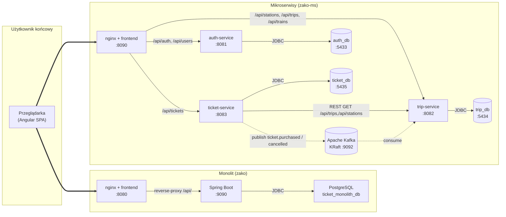

---

## 2. Monolit — diagram kontenerów

Pojedynczy proces JVM obsługujący wszystkie domeny biznesowe. Jeden schemat bazy.

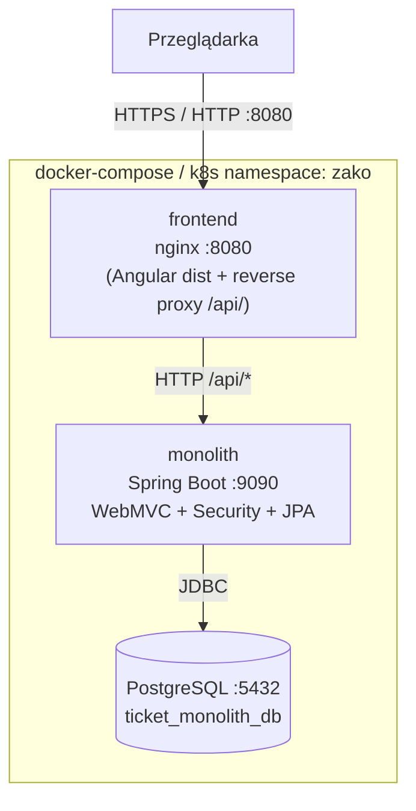

### 2.1 Pakiety / komponenty monolitu

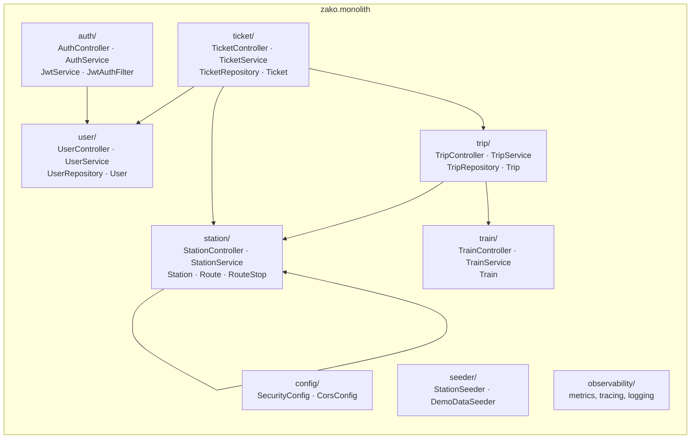

### 2.2 Model danych monolitu — ER

Jedna baza, klucze obce między wszystkimi encjami.

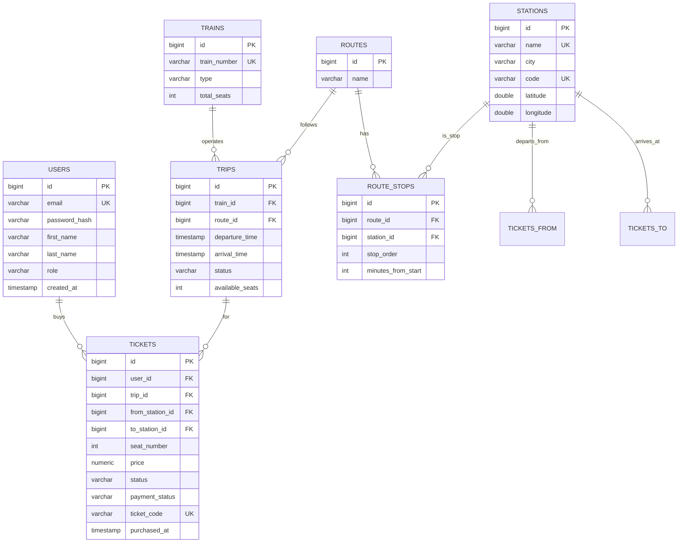

---

## 3. Mikroserwisy — diagram kontenerów

Trzy niezależne procesy JVM, każdy z własną bazą; broker Kafka łączy producenta zdarzeń biletowych z konsumentem.

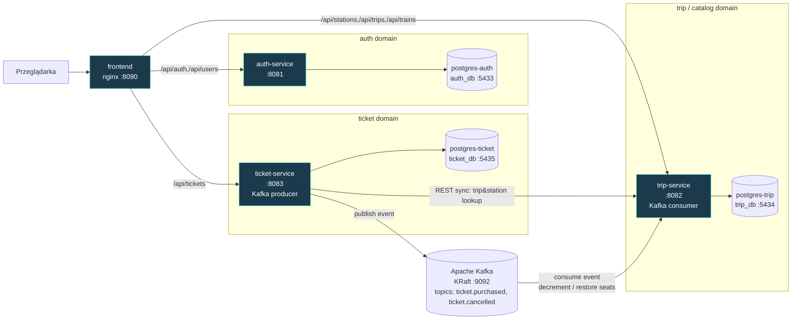

### 3.1 Pakiety / komponenty mikroserwisów

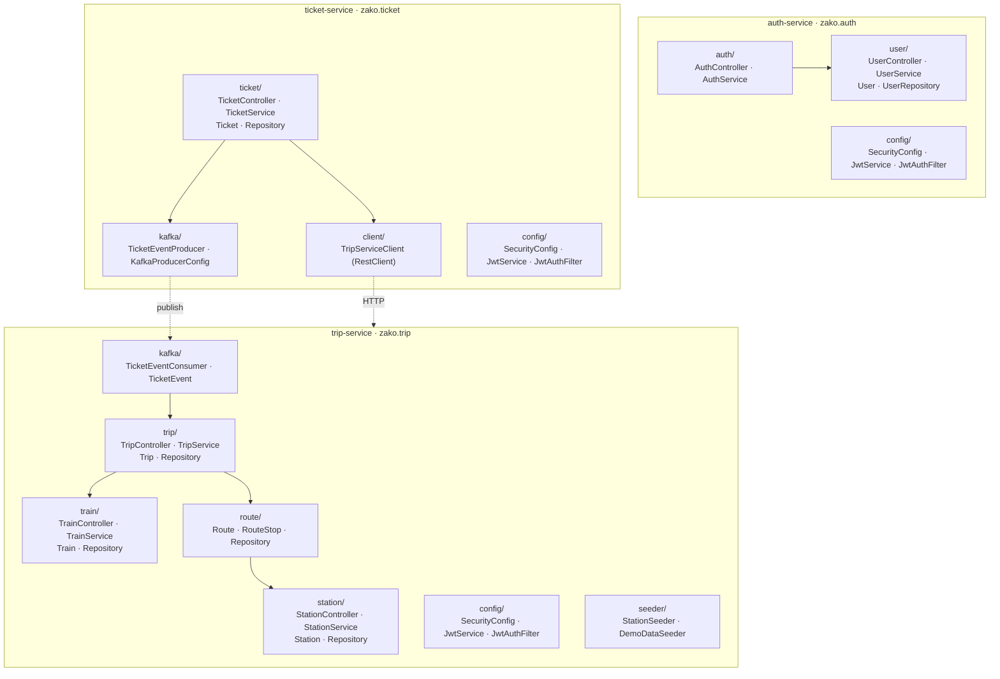

### 3.2 Model danych mikroserwisów — trzy ER, brak FK między bazami

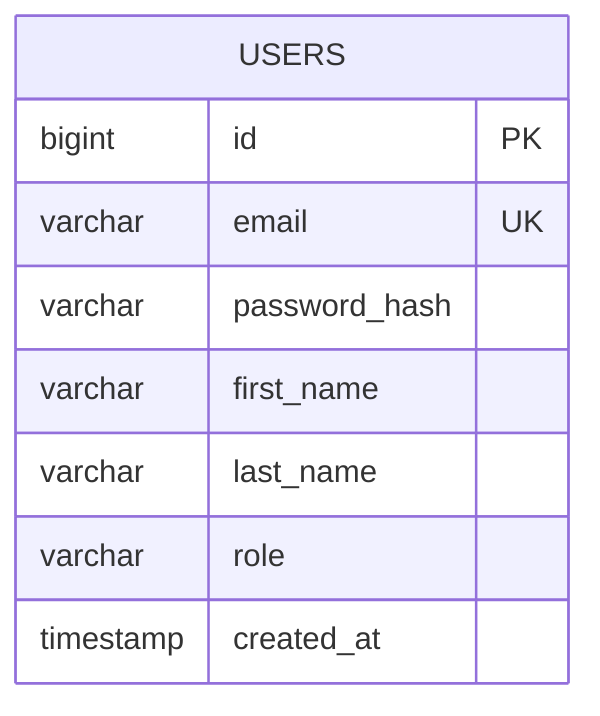
*auth_db — tylko tabela `users`.*

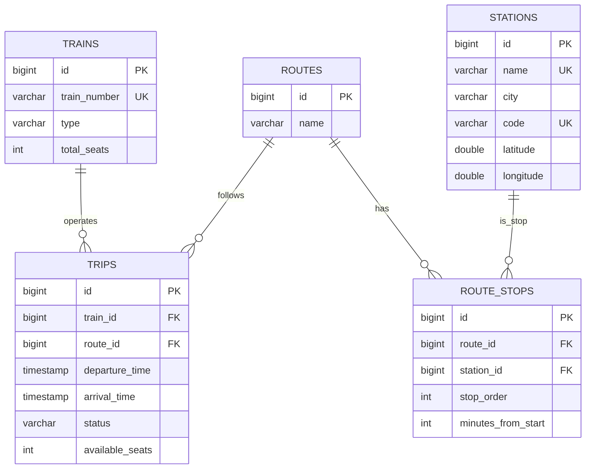
*trip_db — `stations` / `trains` / `routes` / `route_stops` / `trips`.*

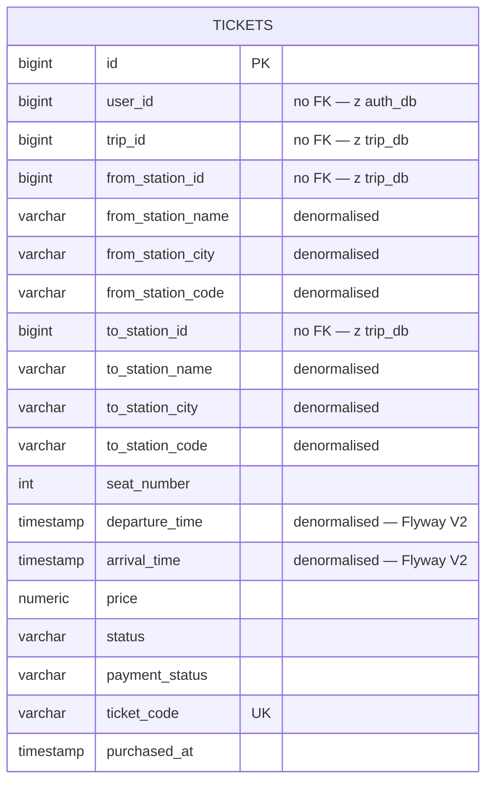
*ticket_db — pojedyncza `tickets`; obce identyfikatory są wyłącznie liczbami, dane z innych domen denormalizowane w momencie zakupu.*

---

## 4. Sekwencja — rejestracja użytkownika

### 4.1 Monolit

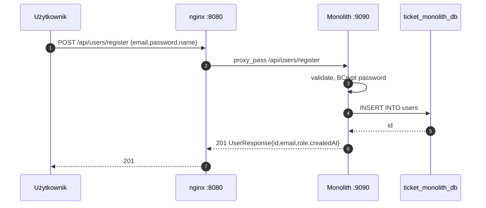

### 4.2 Mikroserwisy

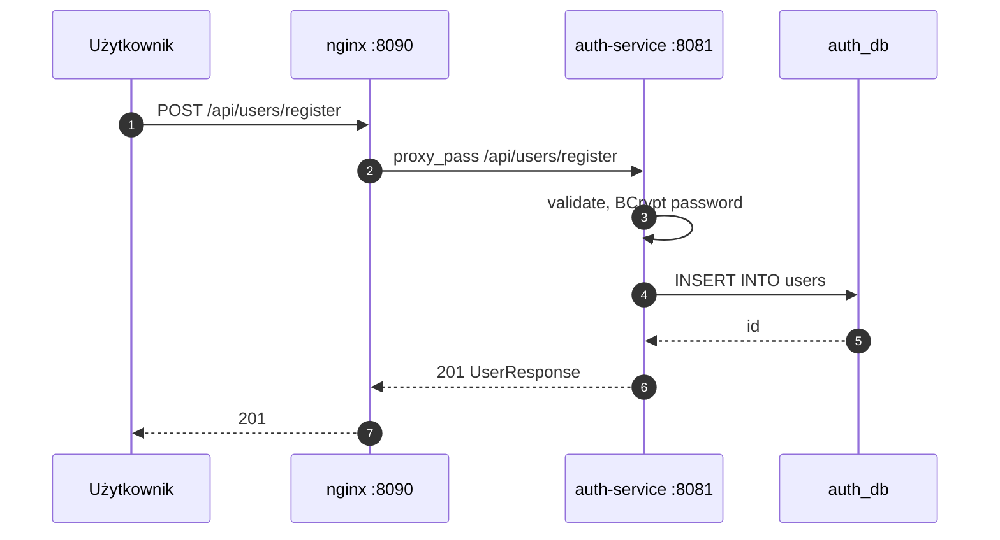
*Identyczne na pierwszy rzut oka — różnica jest w warstwie infrastruktury: w monolicie ten sam proces obsłuży później kupno biletu; tutaj auth-service nigdy nie zobaczy zapytania biletowego.*

---

## 5. Sekwencja — zakup biletu

### 5.1 Monolit (jedna transakcja)

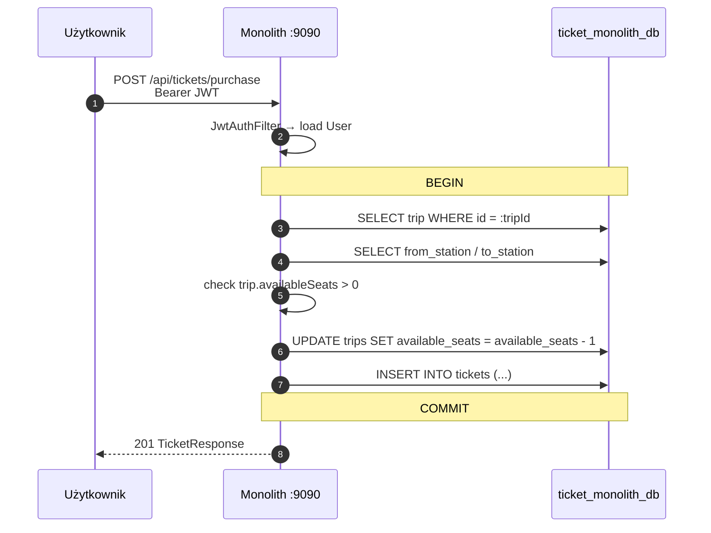

### 5.2 Mikroserwisy (REST + Kafka, eventual consistency)

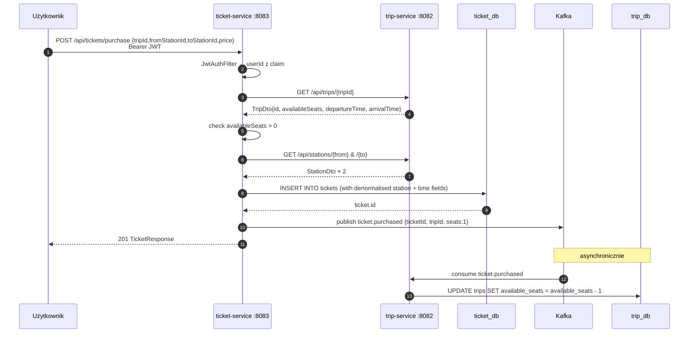

### 5.3 Sekwencja — anulowanie biletu (mikroserwisy)

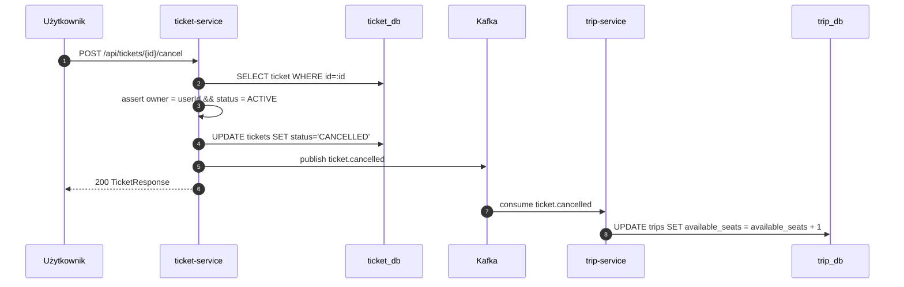

---

## 6. Wdrożenie — docker-compose

### 6.1 Monolit (`docker-compose.yml`)

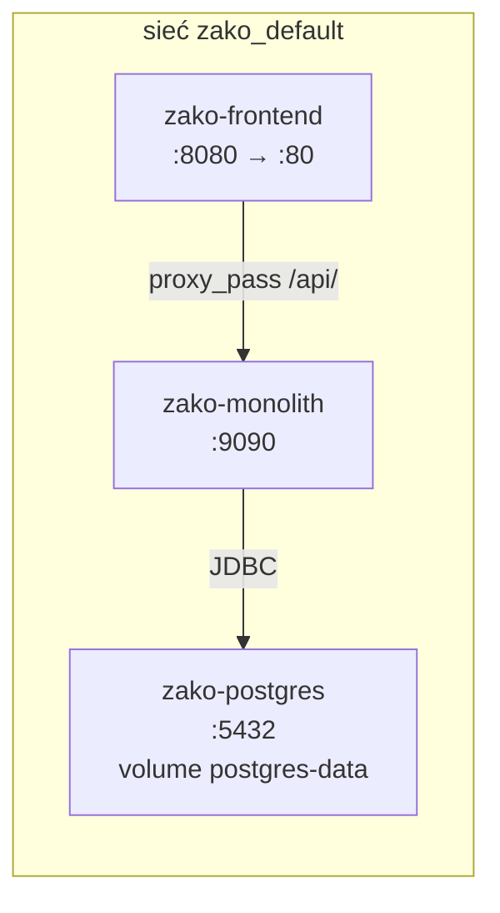

### 6.2 Mikroserwisy (`microservices/docker-compose.yml`)

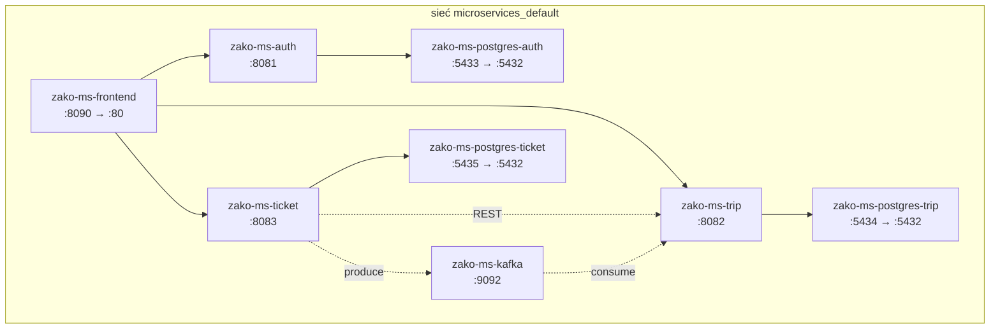

---

## 7. Wdrożenie — Kubernetes

### 7.1 Namespace `zako` (monolit)

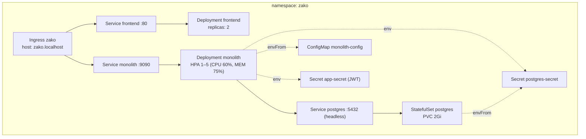

### 7.2 Namespace `zako-ms` (mikroserwisy)

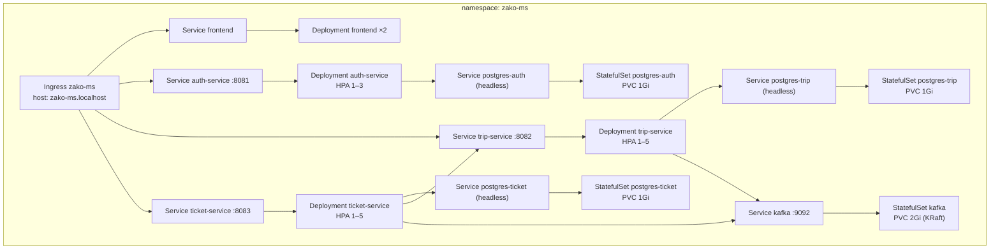

---

## 8. Porównanie — monolit vs mikroserwisy

| Aspekt | Monolit | Mikroserwisy |
|---|---|---|
| Procesy JVM | 1 | 3 (auth + trip + ticket) |
| Bazy Postgres | 1 (ticket_monolith_db) | 3 (auth_db, trip_db, ticket_db) |
| Schemat danych | Wspólny, FK między tabelami | Rozdzielony, brak FK między bazami |
| Komunikacja modułów | wywołania w obrębie JVM (`@Service`) | REST sync (`ticket → trip`) + Kafka async (`ticket → trip`) |
| Transakcyjność | Lokalna `@Transactional` obejmuje wszystkie domeny | Lokalna w obrębie serwisu; spójność seatów: *eventual consistency* przez Kafkę |
| Autoryzacja | Ten sam `SecurityFilterChain` waliduje JWT dla wszystkich `/api/*` | Każdy serwis ma własny `JwtAuthFilter` z tym samym sekretem |
| Wdrożenie (k8s) | 1 Deployment + 1 StatefulSet | 3 Deployment + 4 StatefulSet (3 × Postgres + Kafka) |
| Skalowanie | HPA jednego Deploymentu — wszystko skaluje się razem | HPA na każdy serwis — `trip-service` z 5 replikami, `auth-service` z 3 |
| Awaria | Awaria procesu = brak całej funkcjonalności | Awaria `ticket-service` nie blokuje przeglądania / logowania |
| Czas startu | ~14 s | 3 × ~25–30 s (auth + trip + ticket) + Kafka |

---

## 9. Wybrane decyzje projektowe

1. **Denormalizacja stacji + czasów w `tickets`** (mikroserwisy). Bilet po sprzedaży nie zależy od późniejszych zmian w `trip_db` — frontend wyświetla nazwy i daty bez zapytań N+1 do `trip-service`.
2. **Identyfikatory bez FK** między bazami. Ticket trzyma `user_id`, `trip_id`, `from_station_id` jako liczby, weryfikacja istnienia odbywa się raz, przy zakupie, przez REST do `trip-service`.
3. **Kafka KRaft single-node** zamiast klastra z ZooKeeper — wystarczające dla demo, te same listenery wewnątrz sieci kontenera (`kafka:9092`) i na zewnątrz (`localhost:29092`).
4. **CORS** — monolit używał `setAllowedOrigins("http://localhost:4200")` z czasów dev-servera Angulara; zmienione na `setAllowedOriginPatterns("http://localhost:*", "http://zako.localhost", "http://zako-ms.localhost")`, by frontend ze stacku Docker / k8s mógł rozmawiać z backendem.
5. **`spring-boot-flyway` starter** w `ticket-service` — `flyway-core` sam z siebie nie aktywuje autoconfig w Spring Boot 4.0, więc migracja V1 była po cichu pomijana i tabela `tickets` nie powstawała. Dodanie startera naprawia oba.
